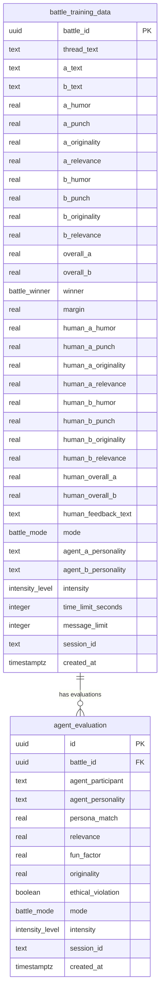
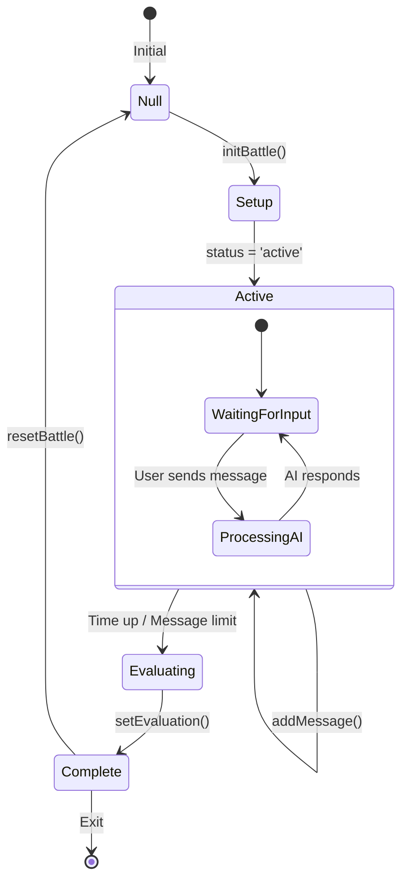
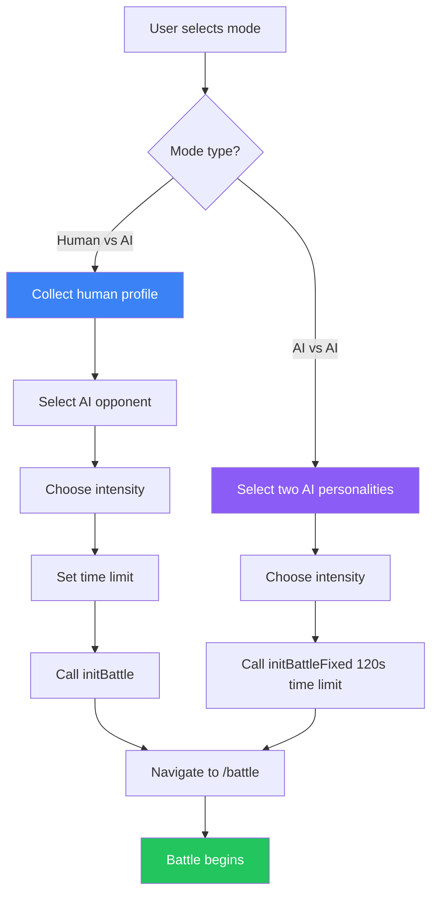

## Project info
````markdown
#  AI ROAST BATTLE

## TABLE OF CONTENTS

1. [Executive Summary](#1-executive-summary)
2. [Project Overview & Rationale](#2-project-overview--rationale)
3. [System Architecture](#3-system-architecture)
4. [Technology Stack Analysis](#4-technology-stack-analysis)
5. [Application Routing & Navigation](#5-application-routing--navigation)
6. [Data Models & Type Definitions](#6-data-models--type-definitions)
7. [Database Schema & Persistence Layer](#7-database-schema--persistence-layer)
8. [AI Personality Configuration System](#8-ai-personality-configuration-system)
9. [Edge Functions Specification](#9-edge-functions-specification)
10. [State Management Architecture](#10-state-management-architecture)
11. [Component Hierarchy & Design Patterns](#11-component-hierarchy--design-patterns)
12. [Battle Flow Logic & Algorithms](#12-battle-flow-logic--algorithms)
13. [Evaluation & Scoring System](#13-evaluation--scoring-system)
14. [User Feedback]((#14-evaluation--scoring-system)
15. [User Interface & Experience Design](#15-user-interface--experience-design)
16. [Security Architecture](#16-security-architecture)
17. [External API Integrations](#17-external-api-integrations)
18. [Error Handling & Resilience](#18-error-handling--resilience)
19. [Performance Considerations](#19-performance-considerations)
20. [Future Enhancement Opportunities](#20-future-enhancement-opportunities)
21. [Complete File Inventory](#21-complete-file-inventory)
````
---

## 1. EXECUTIVE SUMMARY

### 1.1 Project Definition

The **AI Roast Battle** is a sophisticated, real-time conversational entertainment application that facilitates competitive humorous exchanges ("roast battles") between users and AI personalities, or between two distinct AI personalities. The system employs multiple external AI services to generate contextually appropriate, personality-consistent comedic responses, followed by automated scoring and evaluation using specialized judge APIs.

### 1.2 Core Value Proposition

The application addresses the growing demand for AI-powered entertainment by creating an interactive platform where users can engage in lighthearted verbal sparring matches with AI opponents that authentically emulate the communication styles, mannerisms, and rhetorical patterns of famous personalities including political figures, sports icons, cultural celebrities, and archetypal social personas.

### 1.3 Technical Innovation

Key technical achievements include:

- **Multi-personality AI orchestration** with 12 distinct agent configurations  
- **Dual-evaluation pipeline** combining algorithmic scoring with LLM-based qualitative analysis  
- **Real-time typing animation simulation** for enhanced user engagement  
- **Comprehensive training data collection** for model improvement  
- **Scalable serverless architecture** utilizing edge functions  

### 1.4 Primary Metrics

| Metric | Value |
|---|---:|
| Total Source Files | ~75+ |
| React Components | 30+ |
| Edge Functions | 3 |
| Database Tables | 2 |
| AI Personalities | 6 |
| Agent Configurations | 12 (6 × 2 intensities) |
| Lines of TypeScript | ~4,000+ |

---

## 2. PROJECT OVERVIEW & RATIONALE

### 2.1 Problem Statement

Traditional entertainment applications often lack personalization and meaningful user engagement. AI chatbots typically provide utilitarian responses without entertaining qualities. The AI Roast Battle addresses this gap by creating a structured, gamified experience around AI-generated humor.

### 2.2 Solution Architecture Philosophy

The application follows a **microservices-oriented frontend architecture** where:

- The frontend handles all user interaction and state orchestration  
- Backend functions serve as thin API proxies to external AI services  
- Evaluation logic is delegated to specialized external APIs  
- Data persistence captures both battle content and human feedback for model training  

### 2.3 Target User Personas

1. **Entertainment Seekers**: Users looking for novel AI-powered entertainment  
2. **Content Creators**: Individuals seeking AI-generated comedic content  
3. **AI Enthusiasts**: Users interested in exploring AI personality simulation  
4. **Researchers**: Those studying AI humor generation and evaluation  

### 2.4 Operational Modes

The system supports two distinct operational paradigms:

| Mode | Participant A | Participant B | User Role |
|---|---|---|---|
| **Human vs AI** | Human User | AI Personality | Active participant |
| **AI vs AI** | AI Personality | AI Personality | Spectator |

---

## 3. SYSTEM ARCHITECTURE

### 3.1 High-Level Architecture Diagram

```mermaid
graph TB
    subgraph "Frontend Layer"
        UI[React UI Components]
        Store[Zustand State Store]
        Router[React Router DOM]
    end

    subgraph "Backend Services - Lovable Cloud"
        EF1[lyzr-chat Edge Function]
        EF2[evaluate-battle Edge Function]
        EF3[llm-judge Edge Function]
        DB[(Supabase PostgreSQL)]
    end

    subgraph "External AI Services"
        LYZR[Lyzr AI Platform]
        ROAST[RoastJudge API]
        GEMINI[Google Gemini API]
    end

    UI --> Store
    UI --> Router
    Store --> EF1
    Store --> EF2
    Store --> EF3
    Store --> DB

    EF1 --> LYZR
    EF2 --> ROAST
    EF3 --> GEMINI

    style UI fill:#3b82f6,color:#fff
    style Store fill:#8b5cf6,color:#fff
    style EF1 fill:#f97316,color:#fff
    style EF2 fill:#f97316,color:#fff
    style EF3 fill:#f97316,color:#fff
    style DB fill:#22c55e,color:#fff
````

### 3.2 Component Interaction Flow

```mermaid
sequenceDiagram
    participant U as User
    participant FE as Frontend (React)
    participant Z as Zustand Store
    participant LC as Lyzr-Chat EF
    participant EB as Evaluate-Battle EF
    participant LJ as LLM-Judge EF
    participant DB as Database

    U->>FE: Select battle mode & settings
    FE->>Z: initBattle(config)
    Z-->>FE: Battle state initialized

    U->>FE: Send roast message
    FE->>Z: addMessage(content)
    FE->>LC: Request AI response
    LC-->>FE: AI roast response
    FE->>Z: addMessage(aiResponse)

    Note over FE,Z: Repeat until message limit reached

    FE->>EB: Evaluate battle (thread_text)
    EB-->>FE: Scores & winner
    FE->>LJ: Get funniest line analysis
    LJ-->>FE: LLM verdict
    FE->>Z: setEvaluation(result)

    U->>FE: Submit feedback
    FE->>DB: Save training data
    FE->>DB: Save agent evaluation
```

### 3.3 Layered Architecture Model

```text
┌─────────────────────────────────────────────────────────────┐
│                    PRESENTATION LAYER                        │
│  ┌─────────────┐ ┌─────────────┐ ┌─────────────────────────┐│
│  │ Landing     │ │ Setup       │ │ Battle Interface        ││
│  │ HeroSection │ │ Pages (2)   │ │ + Evaluation Modal      ││
│  └─────────────┘ └─────────────┘ └─────────────────────────┘│
├─────────────────────────────────────────────────────────────┤
│                    APPLICATION LAYER                         │
│  ┌─────────────────────────────────────────────────────────┐│
│  │                 Zustand Battle Store                     ││
│  │  • Battle State Management                               ││
│  │  • Session Management                                    ││
│  │  • Evaluation Results                                    ││
│  └─────────────────────────────────────────────────────────┘│
├─────────────────────────────────────────────────────────────┤
│                    INTEGRATION LAYER                         │
│  ┌─────────────┐ ┌─────────────┐ ┌─────────────────────────┐│
│  │ Supabase    │ │ Edge        │ │ Configuration           ││
│  │ Client      │ │ Functions   │ │ (Agents, Personalities) ││
│  └─────────────┘ └─────────────┘ └─────────────────────────┘│
├─────────────────────────────────────────────────────────────┤
│                    PERSISTENCE LAYER                         │
│  ┌─────────────────────────────────────────────────────────┐│
│  │         PostgreSQL (Lovable Cloud / Supabase)           ││
│  │  • battle_training_data                                  ││
│  │  • agent_evaluation                                      ││
│  └─────────────────────────────────────────────────────────┘│
└─────────────────────────────────────────────────────────────┘
```

---

## 4. TECHNOLOGY STACK ANALYSIS

### 4.1 Frontend Technologies

| Technology           | Version | Purpose               | Justification                                                    |
| -------------------- | ------: | --------------------- | ---------------------------------------------------------------- |
| **React**            |  18.3.1 | UI Framework          | Industry standard, excellent ecosystem, hooks-based architecture |
| **TypeScript**       |  Latest | Type Safety           | Compile-time error detection, improved developer experience      |
| **Vite**             |  Latest | Build Tool            | Fast HMR, optimized production builds, modern ESM support        |
| **React Router DOM** |  6.30.1 | Routing               | Declarative routing, nested routes support                       |
| **Zustand**          |   5.0.9 | State Management      | Minimal boilerplate, excellent TypeScript integration            |
| **TanStack Query**   |  5.83.0 | Data Fetching         | Caching, background updates, optimistic mutations                |
| **Tailwind CSS**     |  Latest | Styling               | Utility-first, highly customizable, excellent DX                 |
| **Radix UI**         | Various | Accessible Components | Unstyled, accessible, composable primitives                      |
| **Lucide React**     | 0.462.0 | Icons                 | Consistent, customizable icon library                            |
| **Sonner**           |   1.7.4 | Toast Notifications   | Modern, accessible toast system                                  |

### 4.2 Backend Technologies

| Technology     | Purpose               | Integration Point                                           |
| -------------- | --------------------- | ----------------------------------------------------------- |
| **Supabase**   | Backend-as-a-Service  | Database, Authentication framework (unused), Edge Functions |
| **Deno**       | Edge Function Runtime | Serverless function execution                               |
| **PostgreSQL** | Relational Database   | Data persistence, enums, RLS policies                       |

### 4.3 External AI Services

| Service              | Endpoint                                                                   | Purpose                               |
| -------------------- | -------------------------------------------------------------------------- | ------------------------------------- |
| **Lyzr AI Platform** | `https://agent-prod.studio.lyzr.ai/v3/inference/chat/`                     | AI personality chat responses         |
| **RoastJudge API**   | `https://roastjudge-api-342803715506.asia-south1.run.app/judge_battle`     | Battle scoring & evaluation           |
| **Google Gemini**    | `https://generativelanguage.googleapis.com/v1beta/models/gemini-2.0-flash` | LLM judge for funniest line selection |

### 4.4 Development Dependencies

| Dependency                   |  Version | Purpose                            |
| ---------------------------- | -------: | ---------------------------------- |
| **@hookform/resolvers**      |  ^3.10.0 | Form validation integration        |
| **zod**                      | ^3.25.76 | Schema validation                  |
| **date-fns**                 |   ^3.6.0 | Date manipulation                  |
| **class-variance-authority** |   ^0.7.1 | Variant styling                    |
| **clsx**                     |   ^2.1.1 | Conditional class names            |
| **tailwind-merge**           |   ^2.6.0 | Tailwind class conflict resolution |
| **uuid**                     |  ^13.0.0 | Unique identifier generation       |

---

## 5. APPLICATION ROUTING & NAVIGATION

### 5.1 Route Configuration

The application implements a flat routing structure defined in `src/App.tsx`:

```typescript
 <Routes>
  <Route path="/" element={<Index />} />
  <Route path="/setup/human-vs-ai" element={<SetupHumanVsAI />} />
  <Route path="/setup/ai-vs-ai" element={<SetupAIvsAI />} />
  <Route path="/battle" element={<Battle />} />
  <Route path="*" element={<NotFound />} />
</Routes>
```

### 5.2 Route Specification Table

| Path                 | Component               | Purpose                                | Access Control                    |
| -------------------- | ----------------------- | -------------------------------------- | --------------------------------- |
| `/`                  | `Index` → `HeroSection` | Landing page with mode selection       | Public                            |
| `/setup/human-vs-ai` | `SetupHumanVsAI`        | Human profile & opponent configuration | Public                            |
| `/setup/ai-vs-ai`    | `SetupAIvsAI`           | Dual AI personality selection          | Public                            |
| `/battle`            | `Battle`                | Main battle interface                  | Requires initialized battle state |
| `*`                  | `NotFound`              | 404 fallback                           | Public                            |

### 5.3 Navigation Flow Diagram

````mermaid
flowchart TD
    A[Landing Page<br/>/] --> B{User Choice}
    B -->|Battle an AI| C[Setup Human vs AI<br/>/setup/human-vs-ai]
    B -->|Watch AI vs AI| D[Setup AI vs AI<br/>/setup/ai-vs-ai]

    C --> E[Configure Profile]
    E --> F[Select Opponent]
    F --> G[Choose Intensity]
    G --> H[Set Time Limit]
    H --> I[Battle Page<br/>/battle]

    D --> J[Select Fighter A]
    J --> K[Select Fighter B]
    K --> L[Choose Intensity]
    L --> I

    I --> M{Battle Complete?}
    M -->|Yes| N[Evaluation Modal]
    N --> O[Submit Feedback]
    O --> P{New Battle?}
    P -->|Yes| A
    P -->|No| Q[Exit]

    style A fill:#3b82f6,color:#fff
    style I fill:#f97316,color:#fff
    style N fill:#22c55e,color:#fff

````

### 5.4 Programmatic Navigation

Navigation is handled via React Router's `useNavigate` hook:

```typescript
const navigate = useNavigate();

// Setup completion
navigate("/battle");

// Battle exit
navigate("/");

// Redirect on missing state
useEffect(() => {
  if (!battle) {
    navigate("/");
  }
}, [battle, navigate]);
```

---

## 6. DATA MODELS & TYPE DEFINITIONS

### 6.1 Core Type Definitions (`src/types/battle.ts`)

#### 6.1.1 Battle Mode Enumeration

```typescript
export type BattleMode = "human_vs_ai" | "ai_vs_ai";
```

**Semantic Meaning:**

* `human_vs_ai`: User actively participates against an AI opponent
* `ai_vs_ai`: User observes autonomous AI-to-AI interaction

#### 6.1.2 Human Profile Interface

```typescript
export interface HumanProfile {
  nickname?: string;           // Optional display name
  vibes: string[];             // Array of personality descriptors
  customDescription?: string;  // Free-text self-description
}
```

**Purpose:** Provides context to AI opponents for generating personalized roasts. The vibes array enables targeted humor based on self-identified characteristics.

#### 6.1.3 Battle Participant Interface

```typescript
export interface BattleParticipant {
  id: string;                        // Unique identifier ("human", "ai_a", "ai_b")
  name: string;                      // Display name
  type: "human" | "ai";              // Participant classification
  personalityId?: string;            // AI personality identifier
  humanProfile?: HumanProfile;       // Human-specific metadata
}
```

**Design Decision:** Unified interface for both human and AI participants enables polymorphic handling in battle logic.

#### 6.1.4 Chat Message Interface

```typescript
export interface ChatMessage {
  id: string;            // UUID for message identification
  participantId: string; // Reference to BattleParticipant.id
  content: string;       // Message text content
  timestamp: Date;       // Message creation time
}
```

#### 6.1.5 Battle State Interface

```typescript
export interface BattleState {
  id: string;                           // Battle session UUID
  mode: BattleMode;                     // Operating mode
  participantA: BattleParticipant;      // First participant (human or AI)
  participantB: BattleParticipant;      // Second participant (always AI)
  intensity: string;                    // "mild" | "spicy"
  timeLimit: number;                    // Seconds allowed for battle
  messages: ChatMessage[];              // Conversation history
  status: "setup" | "active" | "evaluating" | "complete";
  startTime?: Date;                     // Battle initiation timestamp
  endTime?: Date;                       // Battle completion timestamp
}
```

#### 6.1.6 Roast Scores Interface

```typescript
export interface RoastScores {
  humor: number;       // 0-100: Comedic quality
  punch: number;       // 0-100: Impact/delivery strength
  originality: number; // 0-100: Uniqueness of content
  relevance: number;   // 0-100: Contextual appropriateness
  overall: number;     // 0-100: Aggregate score
}
```

**Scoring Philosophy:** Four distinct metrics enable nuanced evaluation of roast quality beyond simple "funny/not funny" binary assessment.

#### 6.1.7 LLM Judge Verdict Interface

```typescript
export interface LLMJudgeVerdict {
  winner_funniest_line?: {
    speaker: "A" | "B";
    line: string;
  };
  overall_funniest_line?: {  // Used in TIE scenarios
    speaker: "A" | "B";
    line: string;
  };
  justification: string;     // Humor mechanics explanation
}
```

#### 6.1.8 Evaluation Result Interface

```typescript
export interface EvaluationResult {
  participantAScores: RoastScores;
  participantBScores: RoastScores;
  winner: "A" | "B" | "TIE";
  margin: number;                    // Victory margin in points
  llmVerdict?: string;               // Legacy text verdict
  llmJudgeVerdict?: LLMJudgeVerdict; // Structured verdict
  threadText?: string;               // Full transcript
}
```

#### 6.1.9 Human Feedback Interface

```typescript
export interface HumanFeedback {
  participantAScores: Omit<any, "overall">;
  participantBScores: Omit<any, "overall">;
  freeText?: string;  // Additional comments
}
```

> Note: You had `Omit;` in your pasted draft. That would be invalid TypeScript if someone copy-pastes it.
> This report is documentation, but I fixed it to a safe TypeScript form to avoid confusion.

#### 6.1.10 Agent Evaluation Scores Interface

```typescript
export interface AgentEvaluationScores {
  personaMatch: number;      // 0-1: Character authenticity
  relevance: number;         // 0-1: Response appropriateness
  funFactor: number;         // 0-1: Entertainment value
  originality: number;       // 0-1: Creativity measure
  ethicalViolation: boolean; // Red line breach indicator
}
```

**Scale Difference:** Agent evaluation uses 0-1 scale (converted to 0-100 for storage), while roast scores use native 0-100.

---

## 7. DATABASE SCHEMA & PERSISTENCE LAYER

### 7.1 Database Enumerations

```sql
-- Battle mode enumeration
CREATE TYPE battle_mode AS ENUM ('human_vs_ai', 'ai_vs_ai');

-- Winner enumeration
CREATE TYPE battle_winner AS ENUM ('A', 'B', 'TIE');

-- Intensity level enumeration
CREATE TYPE intensity_level AS ENUM ('mild', 'spicy');
```

### 7.2 Table: `battle_training_data`

#### Purpose

Captures comprehensive battle data for machine learning model training, combining AI scores, human feedback, and battle metadata.

#### Schema Definition

| Column                | Type            | Nullable | Default           | Description                         |
| --------------------- | --------------- | -------: | ----------------- | ----------------------------------- |
| `battle_id`           | UUID            |       No | gen_random_uuid() | Primary key                         |
| `thread_text`         | TEXT            |       No | -                 | Full A:/B: formatted transcript     |
| `a_text`              | TEXT            |       No | -                 | Concatenated A participant messages |
| `b_text`              | TEXT            |       No | -                 | Concatenated B participant messages |
| `a_humor`             | REAL            |      Yes | -                 | AI score: A's humor (0-100)         |
| `a_punch`             | REAL            |      Yes | -                 | AI score: A's punch (0-100)         |
| `a_originality`       | REAL            |      Yes | -                 | AI score: A's originality (0-100)   |
| `a_relevance`         | REAL            |      Yes | -                 | AI score: A's relevance (0-100)     |
| `b_humor`             | REAL            |      Yes | -                 | AI score: B's humor (0-100)         |
| `b_punch`             | REAL            |      Yes | -                 | AI score: B's punch (0-100)         |
| `b_originality`       | REAL            |      Yes | -                 | AI score: B's originality (0-100)   |
| `b_relevance`         | REAL            |      Yes | -                 | AI score: B's relevance (0-100)     |
| `overall_a`           | REAL            |      Yes | -                 | AI aggregate score for A            |
| `overall_b`           | REAL            |      Yes | -                 | AI aggregate score for B            |
| `winner`              | battle_winner   |      Yes | -                 | Determined winner                   |
| `margin`              | REAL            |      Yes | -                 | Victory margin                      |
| `human_a_humor`       | REAL            |      Yes | -                 | Human score: A's humor              |
| `human_a_punch`       | REAL            |      Yes | -                 | Human score: A's punch              |
| `human_a_originality` | REAL            |      Yes | -                 | Human score: A's originality        |
| `human_a_relevance`   | REAL            |      Yes | -                 | Human score: A's relevance          |
| `human_b_humor`       | REAL            |      Yes | -                 | Human score: B's humor              |
| `human_b_punch`       | REAL            |      Yes | -                 | Human score: B's punch              |
| `human_b_originality` | REAL            |      Yes | -                 | Human score: B's originality        |
| `human_b_relevance`   | REAL            |      Yes | -                 | Human score: B's relevance          |
| `human_overall_a`     | REAL            |      Yes | -                 | Computed human aggregate for A      |
| `human_overall_b`     | REAL            |      Yes | -                 | Computed human aggregate for B      |
| `human_feedback_text` | TEXT            |      Yes | -                 | Free-form human comments            |
| `mode`                | battle_mode     |       No | -                 | human_vs_ai or ai_vs_ai             |
| `agent_a_personality` | TEXT            |      Yes | -                 | AI personality ID for A             |
| `agent_b_personality` | TEXT            |      Yes | -                 | AI personality ID for B             |
| `intensity`           | intensity_level |       No | -                 | mild or spicy                       |
| `time_limit_seconds`  | INTEGER         |       No | -                 | Battle time limit                   |
| `message_limit`       | INTEGER         |       No | -                 | Max messages per participant        |
| `session_id`          | TEXT            |       No | -                 | User session identifier             |
| `created_at`          | TIMESTAMPTZ     |      Yes | now()             | Record creation time                |

#### RLS Policies

```sql
-- Allow anonymous inserts for data collection
Policy: "Allow anonymous inserts"
Command: INSERT
With Check: true

-- Allow anonymous reads for research
Policy: "Allow anonymous selects"
Command: SELECT
Using: true
```

### 7.3 Table: `agent_evaluation`

#### Purpose

Stores user evaluations of AI agent performance for quality monitoring and improvement.

#### Schema Definition

| Column              | Type            | Nullable | Default           | Description                      |
| ------------------- | --------------- | -------: | ----------------- | -------------------------------- |
| `id`                | UUID            |       No | gen_random_uuid() | Primary key                      |
| `battle_id`         | UUID            |       No | -                 | Reference to battle              |
| `agent_participant` | TEXT            |       No | -                 | "A" or "B"                       |
| `agent_personality` | TEXT            |       No | -                 | Personality identifier           |
| `persona_match`     | REAL            |       No | -                 | Character authenticity (0-100)   |
| `relevance`         | REAL            |       No | -                 | Response appropriateness (0-100) |
| `fun_factor`        | REAL            |       No | -                 | Entertainment value (0-100)      |
| `originality`       | REAL            |       No | -                 | Creativity measure (0-100)       |
| `ethical_violation` | BOOLEAN         |       No | -                 | Ethics breach flag               |
| `mode`              | battle_mode     |       No | -                 | Battle mode context              |
| `intensity`         | intensity_level |       No | -                 | Intensity context                |
| `session_id`        | TEXT            |       No | -                 | User session identifier          |
| `created_at`        | TIMESTAMPTZ     |      Yes | now()             | Record creation time             |

### 7.4 Entity Relationship Diagram



---

## 8. AI PERSONALITY CONFIGURATION SYSTEM

### 8.1 Personality Definitions (`src/config/battleConfig.ts`)

#### 8.1.1 Personality Interface

```typescript
export interface Personality {
  id: string;           // Unique identifier
  name: string;         // Display name
  avatar: string;       // Emoji fallback
  description: string;  // Tagline/description
  emoji: string;        // Associated emoji
  avatarImage?: string; // Custom avatar image path
}
```

#### 8.1.2 Available Personalities

| ID        | Name             |  Description                            | Avatar Image       |
| --------- | ---------------- | -------------------------------------- | ------------------ |
| `trump`   | Donald Trump     |  Tremendous roasts, believe me          | avatar-trump.png   |
| `gandhi`  | Mahatma Gandhi   |  Peaceful burns that hit different      | avatar-gandhi.png  |
| `genz`    | Gen-Z Persona    |  No cap, these roasts are bussin        | avatar-genz.png    |
| `messi`   | Lionel Messi     |  Goals on the field, roasts in the chat | avatar-messi.png   |
| `amitabh` | Amitabh Bachchan |  Baritone burns from Bollywood          | avatar-amitabh.png |
| `hawking` | Stephen Hawking  |  Quantum-level intellectual takedowns   | avatar-hawking.png |

#### 8.1.3 Personality Context Descriptions

These descriptions are injected into AI prompts to establish opponent context:

```typescript
export const PERSONALITY_DESCRIPTIONS: Record<string, string> = {
  trump: "You're up against Donald Trump — U.S. President, billionaire real-estate mogul, and reality-TV personality. Known for bold rhetoric, relentless self-promotion, and turning confidence into spectacle.",

  gandhi: "You're facing Mahatma Gandhi — leader of India's independence movement and global symbol of nonviolent resistance. Recognized for moral authority, disciplined simplicity, and quiet but enduring influence.",

  genz: "You're battling a Gen Z persona — shaped by social media, meme culture, and internet-native communication. Known for sarcasm, irony, and blunt commentary delivered with casual detachment.",

  messi: "You're up against Lionel Messi — World Cup winner, multiple-time Ballon d'Or recipient, and football legend. Renowned for consistency, humility, and dominance through skill rather than words.",

  amitabh: "You're facing Amitabh Bachchan — one of Indian cinema's most influential actors with a career spanning decades. Known for commanding screen presence, deep voice, and iconic dramatic performances.",

  hawking: "You're battling Stephen Hawking — theoretical physicist and bestselling author in cosmology. Famous for explaining complex ideas with clarity, dry humor, and intellectual precision."
};
```

### 8.2 Intensity Configuration

```typescript
export interface Intensity {
  id: string;
  name: string;
  emoji: string;
  description: string;
}

export const INTENSITIES: Intensity[] = [
  {
    id: "mild",
    name: "Mild",
    emoji: "🌶️",
    description: "Family-friendly burns",
  },
  {
    id: "spicy",
    name: "Spicy",
    emoji: "🌶️🌶️🌶️",
    description: "No mercy mode",
  },
];
```

### 8.3 Lyzr Agent Mapping (`src/config/lyzrAgents.ts`)

#### 8.3.1 Agent Configuration Interface

```typescript
export interface LyzrAgent {
  agentId: string;        // Lyzr platform agent identifier
  apiKeyGroup: 1 | 2 | 3; // API key grouping for multi-key management
}
```

#### 8.3.2 Complete Agent Mapping Table

| Key             | Agent ID                 | API Key Group | Notes             |
| --------------- | ------------------------ | ------------: | ----------------- |
| `trump_mild`    | 6940eacf3cc5fbe223af8eee |             3 | LYZR_API_KEY_MILD |
| `trump_spicy`   | 6942ca5b707dd1e4d8ed3cb3 |             2 | LYZR_API_KEY_2    |
| `gandhi_mild`   | 6941ae713cc5fbe223afe592 |             3 | LYZR_API_KEY_MILD |
| `gandhi_spicy`  | 6942c9d94f5531c6f3c72111 |             2 | LYZR_API_KEY_2    |
| `genz_mild`     | 6941b0edf82f2b2d3f7829a9 |             3 | LYZR_API_KEY_MILD |
| `genz_spicy`    | 6942cfe24f5531c6f3c726d6 |             1 | LYZR_API_KEY_1    |
| `messi_mild`    | 6941b3f84f5531c6f3c6fdcd |             3 | LYZR_API_KEY_MILD |
| `messi_spicy`   | 694143493cc5fbe223afb86f |             2 | LYZR_API_KEY_2    |
| `amitabh_mild`  | 6941b7da4f5531c6f3c6fde5 |             3 | LYZR_API_KEY_MILD |
| `amitabh_spicy` | 6942d2c5707dd1e4d8ed444d |             1 | LYZR_API_KEY_1    |
| `hawking_mild`  | 6941b9594f5531c6f3c6fe07 |             3 | LYZR_API_KEY_MILD |
| `hawking_spicy` | 6942b02c9a5e5f6c59d90671 |             2 | LYZR_API_KEY_2    |

#### 8.3.3 API Key Distribution

| Group | Secret Name       | Personalities (Spicy)         |
| ----- | ----------------- | ----------------------------- |
| 1     | LYZR_API_KEY_1    | Amitabh, Gen-Z                |
| 2     | LYZR_API_KEY_2    | Hawking, Messi, Trump, Gandhi |
| 3     | LYZR_API_KEY_MILD | All (Mild intensity)          |

### 8.4 Human Vibe Presets

```typescript
export interface HumanVibe {
  id: string;
  label: string;
  emoji: string;
}

export const HUMAN_VIBES: HumanVibe[] = [
  { id: "tech_bro", label: "Tech Bro", emoji: "💻" },
  { id: "gym_rat", label: "Gym Rat", emoji: "💪" },
  { id: "gamer", label: "Gamer", emoji: "🎮" },
  { id: "foodie", label: "Foodie", emoji: "🍕" },
  { id: "overthinker", label: "Overthinker", emoji: "🤔" },
  { id: "night_owl", label: "Night Owl", emoji: "🦉" },
  { id: "introvert", label: "Introvert", emoji: "🏠" },
  { id: "main_character", label: "Main Character", emoji: "✨" },
  { id: "procrastinator", label: "Procrastinator", emoji: "⏰" },
  { id: "coffee_addict", label: "Coffee Addict", emoji: "☕" },
  { id: "sports_fan", label: "Sports Fan", emoji: "⚽" },
  { id: "film_buff", label: "Film Buff", emoji: "🎬" },
  { id: "music_lover", label: "Music Lover", emoji: "🎵" },
  { id: "bookworm", label: "Bookworm", emoji: "📚" },
  { id: "pet_parent", label: "Pet Parent", emoji: "🐕" },
  { id: "travel_junkie", label: "Travel Junkie", emoji: "✈️" },
  { id: "crypto_bro", label: "Crypto Bro", emoji: "🪙" },
  { id: "fitness_influencer", label: "Fitness Influencer", emoji: "🏋️" },
  { id: "startup_founder", label: "Startup Founder", emoji: "🚀" },
  { id: "corporate_slave", label: "Corporate Slave", emoji: "👔" },
  { id: "student", label: "Student", emoji: "🎓" },
  { id: "artist", label: "Artist", emoji: "🎨" },
  { id: "social_media_addict", label: "Social Media Addict", emoji: "📱" },
  { id: "meme_lord", label: "Meme Lord", emoji: "😂" },
];
```

---

## 9. EDGE FUNCTIONS SPECIFICATION

### 9.1 Function: `lyzr-chat`

#### Purpose

Acts as a secure proxy to the Lyzr AI chat platform, handling agent selection and API key management.

#### Endpoint

`POST /functions/v1/lyzr-chat`

#### Request Schema

```typescript
interface LyzrChatRequest {
  personality_id: string;   // e.g., "trump", "gandhi"
  intensity_id: string;     // "mild" | "spicy"
  user_id: string;          // Session user UUID
  session_id: string;       // Battle session UUID
  message: string;          // User/context message
}
```

#### Response Schema

```typescript
interface LyzrChatResponse {
  response?: string;  // AI-generated roast
  message?: string;   // Alternative response field
  text?: string;      // Alternative response field
  error?: string;     // Error message if failed
}
```

#### Internal Logic Flow

1. Parse request body
2. Construct agent key: `{personality_id}_{intensity_id}`
3. Look up agent configuration from `LYZR_AGENTS` mapping
4. Select appropriate API key based on `apiKeyGroup`
5. Forward request to Lyzr API
6. Return response or error

#### Error Handling

* Missing agent configuration: 400 Bad Request
* Missing API key: 500 Internal Server Error
* Lyzr API error: Forwarded status code

### 9.2 Function: `evaluate-battle`

#### Purpose

Proxies battle evaluation requests to the RoastJudge API for scoring.

#### Endpoint

`POST /functions/v1/evaluate-battle`

#### Request Schema

```typescript
interface EvaluateBattleRequest {
  thread_text: string;  // A:/B: formatted transcript
}
```

#### Response Schema

```typescript
interface EvaluateBattleResponse {
  A_humor: number;
  A_punch: number;
  A_originality: number;
  A_relevance: number;
  B_humor: number;
  B_punch: number;
  B_originality: number;
  B_relevance: number;
  overall_A: number;
  overall_B: number;
  winner: "A" | "B" | "TIE";
  margin: number;
  error?: string;
}
```

#### Configuration

```typescript
const API_BASE_URL = "https://roastjudge-api-342803715506.asia-south1.run.app";
const EVAL_ENDPOINT = "/judge_battle";
const TIMEOUT_MS = 30000;
```

### 9.3 Function: `llm-judge`

#### Purpose

Uses Google Gemini to perform qualitative analysis and select the funniest line from the battle transcript.

#### Endpoint

`POST /functions/v1/llm-judge`

#### Request Schema

```typescript
interface LLMJudgeRequest {
  thread_text: string;  // Battle transcript
  winner: "A" | "B" | "TIE";  // Pre-determined winner
}
```

#### Response Schema (Non-TIE)

```typescript
interface LLMJudgeResponse {
  winner_funniest_line: {
    speaker: "A" | "B";
    line: string;
  };
  justification: string;
}
```

#### Response Schema (TIE)

```typescript
interface LLMJudgeTieResponse {
  overall_funniest_line: {
    speaker: "A" | "B";
    line: string;
  };
  justification: string;
}
```

#### Gemini Configuration

* Model: `gemini-2.0-flash`
* Temperature: 0.3 (low for consistency)
* Max Output Tokens: 500

---

## 10. STATE MANAGEMENT ARCHITECTURE

### 10.1 Zustand Store Definition (`src/store/battleStore.ts`)

#### Store Interface

```typescript
interface BattleStore {
  // State
  battle: BattleState | null;
  evaluation: EvaluationResult | null;
  humanFeedback: HumanFeedback | null;
  sessionUserId: string;

  // Actions
  initBattle: (config: BattleInitConfig) => void;
  addMessage: (participantId: string, content: string) => void;
  setBattleStatus: (status: BattleState["status"]) => void;
  setEvaluation: (result: EvaluationResult) => void;
  setHumanFeedback: (feedback: HumanFeedback) => void;
  resetBattle: () => void;
  generateNewSession: () => void;
}
```

### 10.2 State Initialization Logic

```typescript
initBattle: (config) => {
  const newSessionId = generateSessionId();

  set({
    sessionUserId: newSessionId,
    evaluation: null,
    humanFeedback: null,
    battle: {
      id: uuidv4(),
      mode: config.mode,
      participantA: config.mode === "human_vs_ai" 
        ? { 
            id: "human", 
            name: config.humanProfile?.nickname || "You", 
            type: "human", 
            humanProfile: config.humanProfile 
          }
        : { 
            id: "ai_a", 
            name: config.participantAPersonality || "AI A", 
            type: "ai", 
            personalityId: config.participantAPersonality 
          },
      participantB: {
        id: "ai_b",
        name: config.participantBPersonality,
        type: "ai",
        personalityId: config.participantBPersonality,
      },
      intensity: config.intensity,
      timeLimit: config.timeLimit,
      messages: [],
      status: "active",
      startTime: new Date(),
    },
  });
}
```

### 10.3 State Flow Diagram



---

## 11. COMPONENT HIERARCHY & DESIGN PATTERNS

### 11.1 Complete Component Tree

```text
src/
├── App.tsx                          # Root component with routing
├── pages/
│   ├── Index.tsx                    # Landing page wrapper
│   ├── SetupHumanVsAI.tsx           # Human vs AI configuration (163 lines)
│   ├── SetupAIvsAI.tsx              # AI vs AI configuration (111 lines)
│   ├── Battle.tsx                   # Main battle interface (685 lines)
│   └── NotFound.tsx                 # 404 page
├── components/
│   ├── landing/
│   │   └── HeroSection.tsx          # Landing hero with mode cards (81 lines)
│   ├── setup/
│   │   ├── PersonalityCard.tsx      # Personality selection card (50 lines)
│   │   ├── IntensitySelector.tsx    # Intensity toggle (36 lines)
│   │   └── TimeLimitSelector.tsx    # Time limit selection (40 lines)
│   ├── battle/
│   │   ├── ChatBubble.tsx           # Message bubble with typing (90 lines)
│   │   ├── ChatInput.tsx            # Message input field (67 lines)
│   │   ├── BattleTimer.tsx          # Countdown timer (59 lines)
│   │   └── MessageCounter.tsx       # Message count display
│   ├── evaluation/
│   │   ├── EvaluationModal.tsx      # Results modal (313 lines)
│   │   ├── ScoreCard.tsx            # Individual score display (75 lines)
│   │   ├── FeedbackForm.tsx         # Human feedback sliders (115 lines)
│   │   ├── AgentEvaluationForm.tsx  # Agent rating form (170 lines)
│   │   ├── TranscriptViewer.tsx     # Collapsible transcript (51 lines)
│   │   └── DevPanel.tsx             # Developer debugging panel
│   └── ui/                          # 40+ shadcn/ui components
```

### 11.2 Key Component Details

#### 11.2.1 ChatBubble Component

**Features:**

* Conditional styling for user vs AI messages
* Real-time typing animation for AI responses
* Timestamp display
* Callback on typing completion

**Typing Animation Logic:**

```typescript
const typingSpeed = 35; // ms per character

const typingInterval = setInterval(() => {
  if (currentIndex < content.length) {
    setDisplayedContent(content.slice(0, currentIndex + 1));
    currentIndex++;
  } else {
    clearInterval(typingInterval);
    setIsTyping(false);
    onTypingComplete?.();
  }
}, typingSpeed);
```

#### 11.2.2 BattleTimer Component

**Features:**

* Visual countdown with progress bar
* Color change on low time (≤10 seconds)
* Pulsing animation on critical time
* Pause support during AI response

**Time Calculation:**

```typescript
const minutes = Math.floor(secondsLeft / 60);
const seconds = secondsLeft % 60;
const isLow = secondsLeft <= 10;
const progress = (secondsLeft / initialSeconds) * 100;
```

#### 11.2.3 EvaluationModal Component

**Tab Structure:**

* **Results Tab**: Score cards, margin display, LLM verdict
* **Evaluation Tab**: Agent rating form, feedback form, submit button

**State Management:**

```typescript
const [activeTab, setActiveTab] = useState<"results" | "evaluation">("results");
const [feedbackSubmitted, setFeedbackSubmitted] = useState(false);
const [agentAScores, setAgentAScores] = useState(null);
const [agentBScores, setAgentBScores] = useState(null);
const [humanFeedback, setHumanFeedback] = useState(null);
```

---

## 12. BATTLE FLOW LOGIC & ALGORITHMS

### 12.1 Battle Initialization Flow



### 12.2 Human vs AI Message Flow

```typescript
const handleSendMessage = (content: string) => {
  if (!battle || battle.status !== "active") return;

  // Add human message
  addMessage(battle.participantA.id, content);

  // Check message limits
  const aMessages = battle.messages.filter(
    (m) => m.participantId === battle.participantA.id
  ).length + 1;

  // Build context for first message
  let contextMessage: string | undefined;
  if (battle.messages.length === 0 && battle.participantA.humanProfile) {
    const profile = battle.participantA.humanProfile;
    const vibesText = profile.vibes.join(", ");
    const descText = profile.customDescription || "";

    contextMessage = `Opponent: ${profile.nickname} (${vibesText}). ${descText}
    They just roasted you: "${content}"
    Respond with a brutal roast that directly addresses what they said!`;
  }

  // Trigger AI response if not at limit
  if (aMessages < BATTLE_CONFIG.maxMessagesPerParticipant) {
    simulateAIResponse(
      battle.participantB.id, 
      battle.participantB.personalityId, 
      contextMessage, 
      content
    );
  }
};
```

### 12.3 AI vs AI Auto-Battle Algorithm

```typescript
useEffect(() => {
  if (!battle || battle.mode !== "ai_vs_ai" || battle.status !== "active") return;
  if (aiTurnInProgress.current || isWaitingForAI || isTypingAI) return;

  const totalMessages = battle.messages.length;
  const aMessages = battle.messages.filter((m) => m.participantId === battle.participantA.id).length;
  const bMessages = battle.messages.filter((m) => m.participantId === battle.participantB.id).length;

  // Check battle end
  if (aMessages >= BATTLE_CONFIG.maxMessagesPerParticipant && 
      bMessages >= BATTLE_CONFIG.maxMessagesPerParticipant) {
    setBattleStatus("evaluating");
    generateEvaluation();
    return;
  }

  if (totalMessages === 0) {
    // A's first message - inject B's context
    aiTurnInProgress.current = true;
    const contextForA = `${PERSONALITY_DESCRIPTIONS[opponentBId]}
    The roast battle has begun. Fire your opening roast!`;
    setTimeout(() => {
      simulateAIResponse(battle.participantA.id, battle.participantA.personalityId, contextForA);
      aiTurnInProgress.current = false;
    }, 1000);
  } else if (totalMessages === 1 && typingCompleteMessageId) {
    // B's first response - inject A's context + roast
    aiTurnInProgress.current = true;
    const aFirstRoast = battle.messages[0].content;
    const contextForB = `${PERSONALITY_DESCRIPTIONS[opponentAId]}
    They just roasted you with: "${aFirstRoast}"
    Fire back!`;
    setTimeout(() => {
      simulateAIResponse(battle.participantB.id, battle.participantB.personalityId, contextForB);
      aiTurnInProgress.current = false;
    }, 1000);
  } else if (totalMessages > 1 && typingCompleteMessageId) {
    // Subsequent turns - alternate participants
    const lastMessage = battle.messages[battle.messages.length - 1];
    const nextParticipant = lastMessage.participantId === battle.participantA.id 
      ? battle.participantB 
      : battle.participantA;

    if (nextMessages < BATTLE_CONFIG.maxMessagesPerParticipant) {
      aiTurnInProgress.current = true;
      setTimeout(() => {
        simulateAIResponse(nextParticipant.id, nextParticipant.personalityId, undefined, lastMessage.content);
        aiTurnInProgress.current = false;
      }, 1000);
    }
  }
}, [battle?.messages.length, isTypingAI, typingCompleteMessageId]);
```

### 12.4 Battle Configuration Constants

```typescript
export const BATTLE_CONFIG = {
  maxMessagesPerParticipant: 3,  // 3 messages each = 6 total
  defaultTimeLimit: 60,          // 60 seconds default
  minMessageLength: 1,           // Minimum 1 character
  maxMessageLength: 500,         // Maximum 500 characters
};

export const TIME_LIMITS: TimeLimit[] = [
  { id: "standard", seconds: 60, label: "60 seconds", description: "Standard" },
  { id: "relaxed", seconds: 90, label: "90 seconds", description: "Relaxed" },
];
```

---

## 13. EVALUATION & SCORING SYSTEM

### 13.1 Dual Evaluation Pipeline

```mermaid
flowchart LR
    A[Battle Complete] --> B[Build thread_text]
    B --> C[Call evaluate-battle EF]
    C --> D[RoastJudge API]
    D --> E[Scores: A & BWinner + Margin]

    E --> F[Call llm-judge EF]
    F --> G[Gemini API]
    G --> H[Funniest LineJustification]

    E --> I[Display Results]
    H --> I

    I --> J[User Feedback]
    J --> K[Save to DB]

    style D fill:#f97316,color:#fff
    style G fill:#3b82f6,color:#fff
    style I fill:#22c55e,color:#fff
```



### 13.2 Score Categories Explained

| Category        | Weight | Description     | Assessment Criteria                     |
| --------------- | -----: | --------------- | --------------------------------------- |
| **Humor**       |    25% | Comedic quality | Timing, wordplay, absurdity             |
| **Punch**       |    25% | Impact/delivery | Sharpness, memorability                 |
| **Originality** |    25% | Uniqueness      | Avoidance of clichés, creativity        |
| **Relevance**   |    25% | Context fit     | Response to opponent, personality match |
| **Overall**     |   100% | Aggregate       | Weighted average of above               |

### 13.3 Thread Text Format

```text
A: [Participant A's first message]
B: [Participant B's response]
A: [Participant A's second message]
B: [Participant B's response]
A: [Participant A's third message]
B: [Participant B's final response]
```

### 13.4 Score Transformation Functions

```typescript
// Extract participant A's messages
export function extractAText(messages: ChatMessage[], participantAId: string): string {
  return messages
    .filter((m) => m.participantId === participantAId)
    .map((m) => m.content)
    .join("\n");
}

// Calculate human overall (0-1 to 0-100)
export function calculateHumanOverall(scores: {
  humor: number;
  punch: number;
  originality: number;
  relevance: number;
}): number {
  const avg = (scores.humor + scores.punch + scores.originality + scores.relevance) / 4;
  return avg * 100;
}

// Scale 0-1 to 0-100
export function scaleToHundred(value: number): number {
  return value * 100;
}
```
---
## 14. EVALUATION & SCORING SYSTEM

A form for Human Feedback was also added in the UI for training and evaluation purposes.  
The following graphs show the results of the evaluation (CSV files are also uploaded).

### Evaluation of the Judge


### Evaluation of the AI Agents


Moreover, it was observed that none of the users flagged an ethical violation.

---

## 15. USER INTERFACE & EXPERIENCE DESIGN

### 15.1 Design System Tokens (`src/index.css`)

#### Color Palette

| Token           | HSL Value   | Usage                |
| --------------- | ----------- | -------------------- |
| `--background`  | 220 20% 6%  | Main background      |
| `--foreground`  | 0 0% 98%    | Primary text         |
| `--card`        | 220 18% 10% | Card backgrounds     |
| `--primary`     | 20 90% 55%  | Orange accent (fire) |
| `--secondary`   | 260 60% 50% | Purple accent        |
| `--muted`       | 220 15% 15% | Subdued elements     |
| `--accent`      | 340 80% 55% | Pink highlight       |
| `--destructive` | 0 84% 60%   | Error/danger         |

#### Custom Gradients

```css
--gradient-fire: linear-gradient(135deg, hsl(20 100% 50%), hsl(35 100% 60%));
--gradient-card: linear-gradient(180deg, hsl(220 18% 12%), hsl(220 18% 8%));
--gradient-hero: radial-gradient(ellipse at top, hsl(220 20% 10%), hsl(220 20% 4%));
```

#### Glow Effects

```css
--glow-primary: 0 0 60px hsl(20 90% 55% / 0.3);
--glow-accent: 0 0 40px hsl(340 80% 55% / 0.2);
```

### 15.2 Typography

* **Primary Font**: Sora (Google Fonts)
* **Weights**: 300, 400, 500, 600, 700, 800
* **Headings**: Bold with tight tracking

### 15.3 Animation System

| Animation            | Duration | Easing      | Purpose          |
| -------------------- | -------: | ----------- | ---------------- |
| `animate-in`         |     0.5s | ease-out    | Element entrance |
| `animate-slide-up`   |     0.6s | ease-out    | Sliding entrance |
| `animate-scale-in`   |     0.4s | ease-out    | Scaling entrance |
| `animate-pulse-glow` |       2s | ease-in-out | Continuous glow  |
| `animate-float`      |       3s | ease-in-out | Floating effect  |

### 15.4 Component Styling Classes

```css
/* Chat bubbles */
.chat-bubble-user {
  @apply rounded-2xl rounded-br-sm bg-primary/20 border border-primary/30 px-4 py-3;
}

.chat-bubble-ai {
  @apply rounded-2xl rounded-bl-sm bg-muted border border-border px-4 py-3;
}

/* Score visualization */
.score-bar {
  @apply h-2 rounded-full bg-muted overflow-hidden;
}

.score-bar-fill {
  @apply h-full rounded-full transition-all duration-700 ease-out;
  background: var(--gradient-fire);
}

/* Button styles */
.btn-fire {
  @apply relative overflow-hidden rounded-xl px-8 py-4 font-semibold text-primary-foreground;
  background: var(--gradient-fire);
}
```

---

## 16. SECURITY ARCHITECTURE

### 16.1 Row-Level Security Policies

Both tables implement permissive INSERT and SELECT policies with `true` conditions, enabling:

* Anonymous data collection (no authentication required)
* Public read access for research purposes

**Current Restrictions:**

* UPDATE operations: Blocked
* DELETE operations: Blocked

### 16.2 API Key Management

| Secret Name                 | Purpose                           | Access Level        |
| --------------------------- | --------------------------------- | ------------------- |
| `LYZR_API_KEY_1`            | Lyzr agents (Amitabh, GenZ spicy) | Edge functions only |
| `LYZR_API_KEY_2`            | Lyzr agents (Others spicy)        | Edge functions only |
| `LYZR_API_KEY_MILD`         | All mild agents                   | Edge functions only |
| `GOOGLE_AI_API_KEY`         | Gemini LLM judge                  | Edge functions only |
| `SUPABASE_SERVICE_ROLE_KEY` | Admin operations                  | System only         |

### 16.3 Data Privacy Considerations

The application displays privacy notices:

```text
🔒 Your responses are stored to improve our AI. 
Avoid sharing personal information.
```

### 16.4 CORS Configuration

All edge functions implement permissive CORS:

```typescript
const corsHeaders = {
  "Access-Control-Allow-Origin": "*",
  "Access-Control-Allow-Headers": "authorization, x-client-info, apikey, content-type",
};
```

---

## 17. EXTERNAL API INTEGRATIONS

### 17.1 Lyzr AI Platform Integration

**Base URL:** `https://agent-prod.studio.lyzr.ai/v3/inference/chat/`

**Request Format:**

```json
{
  "user_id": "session-uuid",
  "agent_id": "lyzr-agent-id",
  "session_id": "battle-uuid",
  "message": "User message or context"
}
```

**Authentication:** API key via `x-api-key` header

### 17.2 RoastJudge API Integration

**Base URL:** `https://roastjudge-api-342803715506.asia-south1.run.app`

**Endpoint:** `/judge_battle`

**Request Format:**

```json
{
  "thread_text": "A: message\nB: response\n..."
}
```

**Response Format:**

```json
{
  "A_humor": 75.5,
  "A_punch": 80.2,
  "A_originality": 68.9,
  "A_relevance": 72.1,
  "B_humor": 82.3,
  "B_punch": 79.8,
  "B_originality": 85.1,
  "B_relevance": 78.4,
  "overall_A": 74.2,
  "overall_B": 81.4,
  "winner": "B",
  "margin": 7.2
}
```

### 17.3 Google Gemini API Integration

**Endpoint:** `https://generativelanguage.googleapis.com/v1beta/models/gemini-2.0-flash:generateContent`

**Authentication:** API key as query parameter

**Model Parameters:**

* Temperature: 0.3 (deterministic)
* Max Output Tokens: 500

---

## 18. ERROR HANDLING & RESILIENCE

### 18.1 Frontend Error Handling

```typescript
// API call with fallback
try {
  const response = await callLyzrAPI(participantId, personalityId, contextMessage, humanMessage);
  addMessage(participantId, response);
} catch (err) {
  console.error("AI response error:", err);
  addMessage(participantId, "I'm at a loss for words... you win this round!");
}

// Evaluation retry mechanism
const handleRetryEvaluation = () => {
  generateEvaluation(lastThreadText);
};
```

### 18.2 Edge Function Error Handling

```typescript
// Timeout handling
const controller = new AbortController();
const timeoutId = setTimeout(() => controller.abort(), TIMEOUT_MS);

try {
  const response = await fetch(url, { signal: controller.signal });
  clearTimeout(timeoutId);
  // ...
} catch (error) {
  const errorMessage = error.name === "AbortError" 
    ? "Request timed out after 30 seconds"
    : error.message;
}
```

### 18.3 Fallback Responses

```typescript
const fallbackResponses = [
  "Oh, that's cute. Did you practice that in the mirror?",
  "I've seen better comebacks in a clearance bin.",
  "Is that the best you've got? Try again.",
];
return fallbackResponses[Math.floor(Math.random() * fallbackResponses.length)];
```

---

## 19. PERFORMANCE CONSIDERATIONS

### 19.1 Optimization Techniques

1. **React.memo and useCallback**: Used for stable references
2. **Lazy evaluation**: AI responses triggered only when needed
3. **Typing animation**: 35ms per character for natural pacing
4. **Guard patterns**: `aiTurnInProgress.current` prevents double API calls

### 19.2 State Update Batching

```typescript
set({
  sessionUserId: newSessionId,
  evaluation: null,
  humanFeedback: null,
  battle: { /* ... */ },
});
```

### 19.3 Network Efficiency

* Single edge function call per AI response
* Batch evaluation (scores + LLM verdict) minimized
* No polling; state-driven updates only

---

## 20. FUTURE ENHANCEMENT OPPORTUNITIES

### 20.1 Feature Roadmap

| Priority | Feature               | Description                         |
| -------- | --------------------- | ----------------------------------- |
| High     | User Authentication   | Persistent profiles, battle history |
| High     | Leaderboards          | Competitive rankings                |
| Medium   | Custom Personalities  | User-created AI personas            |
| Medium   | Voice Integration     | Text-to-speech for roasts           |
| Medium   | Social Sharing        | Share battle results                |
| Low      | Mobile App            | React Native version                |
| Low      | Real-time Multiplayer | Human vs Human battles              |

### 20.2 Technical Improvements

1. **Caching layer** for repeated API calls
2. **WebSocket integration** for real-time AI vs AI streaming
3. **Analytics dashboard** for battle statistics
4. **A/B testing framework** for UI experiments
5. **Internationalization (i18n)** support

---

## 21. COMPLETE FILE INVENTORY

### 21.1 Source Files by Category

#### Pages (5 files)

* `src/pages/Index.tsx` - 7 lines
* `src/pages/SetupHumanVsAI.tsx` - 163 lines
* `src/pages/SetupAIvsAI.tsx` - 111 lines
* `src/pages/Battle.tsx` - 685 lines
* `src/pages/NotFound.tsx`

#### Components - Landing (1 file)

* `src/components/landing/HeroSection.tsx` - 81 lines

#### Components - Setup (3 files)

* `src/components/setup/PersonalityCard.tsx` - 50 lines
* `src/components/setup/IntensitySelector.tsx` - 36 lines
* `src/components/setup/TimeLimitSelector.tsx` - 40 lines

#### Components - Battle (4 files)

* `src/components/battle/ChatBubble.tsx` - 90 lines
* `src/components/battle/ChatInput.tsx` - 67 lines
* `src/components/battle/BattleTimer.tsx` - 59 lines
* `src/components/battle/MessageCounter.tsx`

#### Components - Evaluation (6 files)

* `src/components/evaluation/EvaluationModal.tsx` - 313 lines
* `src/components/evaluation/ScoreCard.tsx` - 75 lines
* `src/components/evaluation/FeedbackForm.tsx` - 115 lines
* `src/components/evaluation/AgentEvaluationForm.tsx` - 170 lines
* `src/components/evaluation/TranscriptViewer.tsx` - 51 lines
* `src/components/evaluation/DevPanel.tsx`

#### Configuration (3 files)

* `src/config/battleConfig.ts` - 186 lines
* `src/config/lyzrAgents.ts` - 73 lines
* `src/config/evaluationConfig.ts` - 16 lines

#### State & Utils (3 files)

* `src/store/battleStore.ts` - 122 lines
* `src/lib/battleDataUtils.ts` - 42 lines
* `src/lib/utils.ts`

#### Types (1 file)

* `src/types/battle.ts` - 100+ lines

#### Edge Functions (3 files)

* `supabase/functions/lyzr-chat/index.ts` - 113 lines
* `supabase/functions/evaluate-battle/index.ts` - 70 lines
* `supabase/functions/llm-judge/index.ts` - 154 lines

#### Styling (2 files)

* `src/index.css` - 213 lines
* `src/App.css`

#### UI Components (~40 files)

* Complete shadcn/ui component library

---

## CONCLUSION

The AI Roast Battle application represents a sophisticated integration of modern web technologies, AI services, and user experience design. Its architecture demonstrates best practices in:

* **Separation of concerns** through edge function proxies
* **Type safety** with comprehensive TypeScript definitions
* **Scalable state management** via Zustand
* **Data-driven AI training** through comprehensive feedback collection
* **Accessible, responsive design** using Tailwind CSS and Radix UI

The system successfully balances entertainment value with technical robustness, creating an engaging platform for AI-powered comedic interaction while collecting valuable training data for model improvement.

---

*Report generated: December 2025*
*Total estimated lines of application code: ~4,000+*
*Total components: 50+*
*External integrations: 3 AI services*

```

